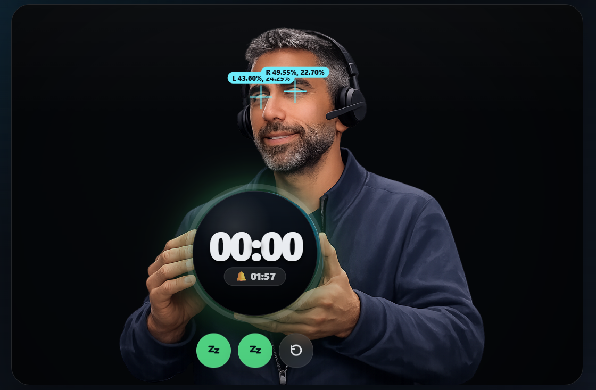
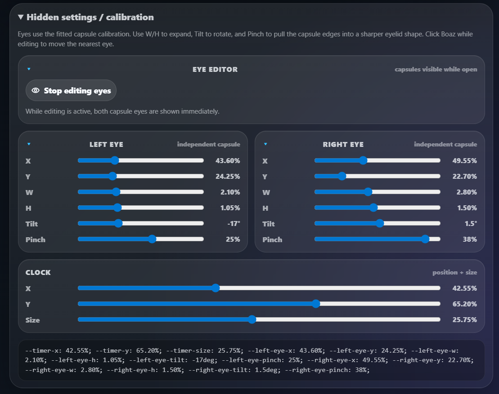

# BoazTimer

A playful single-file timer web app with Boaz holding the clock.

### Live page after GitHub Pages is enabled:

https://dormandel.github.io/BoazTimer/

```txt
https://dormandel.github.io/BoazTimer/
```
<details>




  
</details>

## Features

- SVG favicon for the browser tab.
- Dynamic tab title showing the live countdown.
- Blinking tab title when the alarm is ringing.
- Alarm beep with Snooze / Stop / Reset.
- Sound mute toggle.
- Saved eye and clock calibration using `localStorage`.
- Dark/glow intensity slider saved locally.
- Mobile/fullscreen mode.
- Shareable timer links:
  - `?minutes=5`
  - `?preset=300`
- Works as a static GitHub Pages site.

## Files needed for GitHub Pages

The important files are:

```txt
index.html
favicon.svg
README.md
screenshots/
```

GitHub Pages can serve this directly from the repo root.

## Query examples

Start with 5 minutes:

```txt
https://dormandel.github.io/BoazTimer/?minutes=5
```

Start with 300 seconds:

```txt
https://dormandel.github.io/BoazTimer/?preset=300
```

## Local preview

Double-click `index.html`, or run a tiny local server:

```powershell
python -m http.server 5173
```

Then open:

```txt
http://localhost:5173
```
